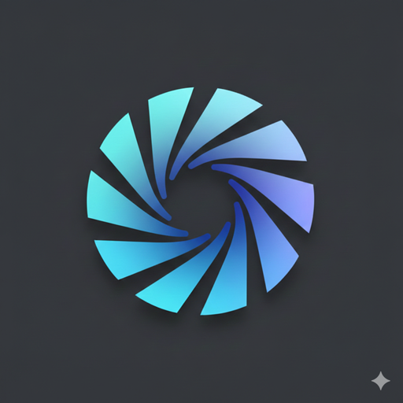

# QuickCuts

A fast, native macOS app for stitching videos and images together. Built with Tauri, React, and FFmpeg.



## Features

- **Drag & Drop** - Drop videos and images to build your timeline
- **Smart Ordering** - Files automatically sorted by creation date, or drag to reorder
- **Text Covers** - Add title cards with customizable text and colors (black on white or white on black)
- **Multiline Text** - Cover text supports multiple lines with automatic font scaling
- **Format Presets** - Portrait (9:16), Square (1:1), and Landscape (16:9)
- **Auto-Detect** - Format preset auto-selected based on your first video's aspect ratio
- **Fast Export** - Hardware-accelerated encoding with VideoToolbox
- **Instant Concat** - Same-format videos are joined without re-encoding (like iOS Shortcuts)
- **Video Preview** - Long-press any video in the timeline to preview it
- **Universal Binary** - Native support for both Intel and Apple Silicon Macs

## Screenshots

The app features a clean, dark interface with:
- Preview panel for real-time video preview
- Drag-and-drop timeline with thumbnails
- Cover text editor with live preview
- One-click export with progress tracking

## Installation

### From Release (Recommended)

1. Download the latest `.dmg` from [Releases](https://github.com/kennethhc/quickcuts/releases)
2. Open the DMG and drag QuickCuts to Applications
3. First launch: Right-click → Open (to bypass Gatekeeper for unsigned apps)

### Build from Source

#### Prerequisites

- Node.js 18+
- Rust 1.77+
- Xcode Command Line Tools

#### Setup

```bash
# Clone the repository
git clone https://github.com/kennethhc/quickcuts.git
cd quickcuts

# Install dependencies
npm install

# Download FFmpeg binaries (required for building)
# See "FFmpeg Setup" section below
```

#### FFmpeg Setup

The app bundles static FFmpeg binaries. Download them before building:

**For Intel Macs (x86_64):**
- FFmpeg: https://evermeet.cx/ffmpeg/
- FFprobe: https://evermeet.cx/ffmpeg/ (separate download)

**For Apple Silicon (arm64):**
- FFmpeg: https://www.osxexperts.net/
- FFprobe: https://www.osxexperts.net/

Place the binaries in `src-tauri/binaries/` with these names:
```
ffmpeg-x86_64-apple-darwin
ffmpeg-aarch64-apple-darwin
ffprobe-x86_64-apple-darwin
ffprobe-aarch64-apple-darwin
```

For universal builds, create combined binaries:
```bash
cd src-tauri/binaries
lipo -create ffmpeg-x86_64-apple-darwin ffmpeg-aarch64-apple-darwin -output ffmpeg-universal-apple-darwin
lipo -create ffprobe-x86_64-apple-darwin ffprobe-aarch64-apple-darwin -output ffprobe-universal-apple-darwin
```

#### Build Commands

```bash
# Development mode
npm run tauri:dev

# Production build (current architecture)
npm run tauri:build

# Universal build (Intel + Apple Silicon)
npm run tauri -- build --target universal-apple-darwin
```

The built app will be in `src-tauri/target/release/bundle/`.

## Usage

1. **Add Media** - Drag and drop videos/images onto the app, or use the drop zone
2. **Arrange** - Drag items in the timeline to reorder them
3. **Add Cover** (optional) - Type text in the cover editor to add a title card
4. **Choose Format** - Select Portrait, Square, or Landscape (auto-detected from first video)
5. **Export** - Click Export, choose filename and location, wait for completion

### Supported Formats

**Input:**
- Videos: MP4, MOV, AVI, MKV, WebM
- Images: JPG, JPEG, PNG, WebP, GIF

**Output:**
- MP4 (H.264) for social media presets
- MOV (ProRes) for professional presets

### Tips

- **Fast Export**: When all your videos have the same resolution and framerate, QuickCuts uses stream copy (no re-encoding) for near-instant export
- **Preview Videos**: Long-press (hold click) on any video thumbnail to preview it
- **Cover Duration**: Covers are always 4 seconds
- **Image Duration**: Images are displayed for 4 seconds each

## Tech Stack

- **Framework**: [Tauri 2.x](https://tauri.app/) - Native app with web frontend
- **Frontend**: React 19 + TypeScript + Tailwind CSS
- **State**: [Zustand](https://github.com/pmndrs/zustand) - Lightweight state management
- **Video**: [FFmpeg](https://ffmpeg.org/) - Video processing (bundled)
- **Drag & Drop**: [@dnd-kit](https://dndkit.com/) - Accessible drag and drop

## Project Structure

```
quickcuts/
├── src/                    # React frontend
│   ├── components/         # UI components
│   ├── hooks/              # Custom hooks (useExport, useMediaFiles)
│   ├── stores/             # Zustand state store
│   └── utils/              # Presets, helpers
├── src-tauri/              # Rust backend
│   ├── src/
│   │   ├── commands/       # Tauri commands (ffmpeg, metadata, files)
│   │   └── lib.rs          # App entry point
│   ├── binaries/           # FFmpeg binaries (not in git)
│   └── icons/              # App icons
└── package.json
```

## Contributing

Contributions are welcome! Please feel free to submit a Pull Request.

## License

MIT License - see [LICENSE](LICENSE) for details.

## Acknowledgments

- FFmpeg static builds from [evermeet.cx](https://evermeet.cx/ffmpeg/) and [osxexperts.net](https://www.osxexperts.net/)
- Built with [Tauri](https://tauri.app/)
